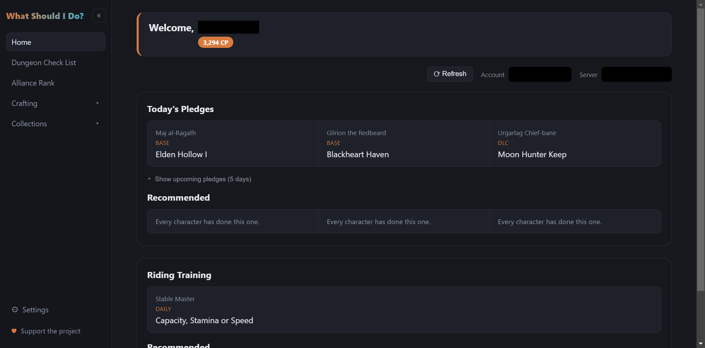
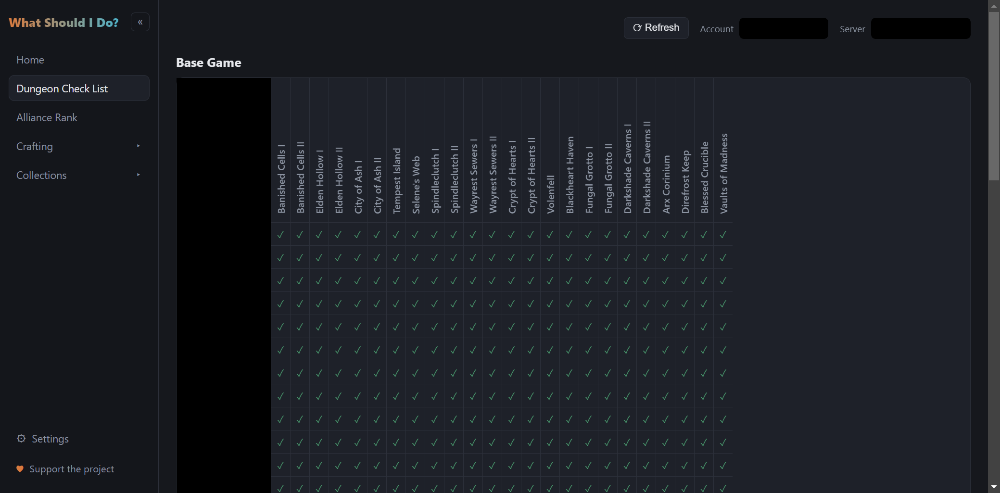
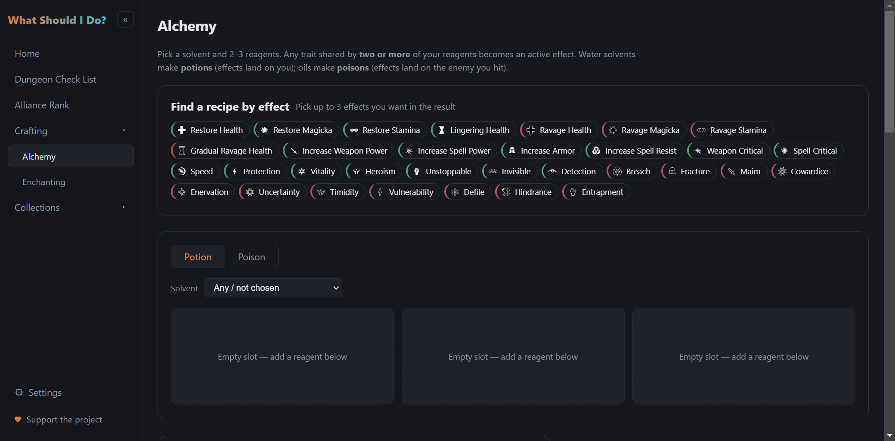
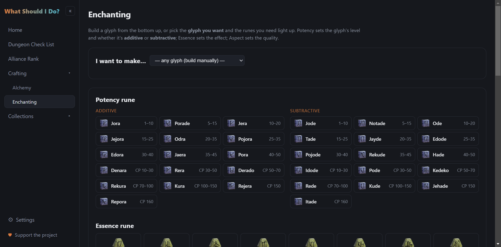

# What Should I Do

  [](./LICENSE)      [](https://github.com/Illyriat/WhatShouldIDo/releases/latest)

### A desktop companion that tells you what to do today across every character on every account, for every server.

[](https://github.com/Illyriat/WhatShouldIDo/releases/latest/download/WhatShouldIDo-Setup.exe)
[-000000?style=for-the-badge&logo=apple&logoColor=white)](https://github.com/Illyriat/WhatShouldIDo/releases/latest/download/WhatShouldIDo-arm64.dmg)
[-FCC624?style=for-the-badge&logo=linux&logoColor=black)](https://github.com/Illyriat/WhatShouldIDo/releases/latest/download/WhatShouldIDo.AppImage)

These always grab the newest release directly - no need to dig through the [Releases page](https://github.com/Illyriat/WhatShouldIDo/releases). None of these builds are code-signed yet, so expect a "Windows protected your PC" (click **More info → Run anyway**) or macOS Gatekeeper warning (right-click the app → **Open**) on first launch - that's expected, not a sign anything's broken. The macOS build is Apple Silicon (M-series) only for now; there's no Intel Mac build yet. Prefer a `.deb`? Grab it from the [latest release](https://github.com/Illyriat/WhatShouldIDo/releases/latest) instead.

    * For this app to work you first need the required addons installed in ESO (see below).
        ** Log into each character at least once with them active so they have data to read.
        ** ESO only writes SavedVariables to disk on logout or /reloadui - do one of those before checking the app for the latest state.

This app reads directly from your local ESO SavedVariables files - no manual entry, no separate account linking. It finds every account and character on your PC automatically from the standard `Documents\Elder Scrolls Online` location - and if Windows/OneDrive has redirected your Documents folder elsewhere, Settings lets you point it at the right one.

As a whole this will track:
- Today's three Undaunted Pledges, resolved against real dungeon names, with a note if a dungeon can't yet be mapped
- Which of your characters still need to run each of today's pledge dungeons (per-character quest completion, not achievement-based, so it's accurate per character rather than per account)
- Which characters are ready for their daily riding (Capacity/Stamina/Speed) training, and which have already maxed out
- A full completion checklist of every base-game and DLC dungeon quest, per character, split into two tables so the long DLC list stays readable
- An Account and Server switcher, so multi-account and NA/EU players see only the characters relevant to what they've selected
- A Potion Crafting page: pick a solvent and 2-3 reagents and see exactly which effects the mix produces (and which land on the wrong side) - or work backwards, pick the effects you want and it lists the reagent combinations that make them, best (cleanest) first. Full reagent/effect data with official in-game icons bundled offline
- An Enchanting page: pick Potency + Essence + Aspect runes and see the exact glyph produced - item type, effect, level and quality - or pick the glyph you want and the runes you need light up. Full essence-rune reference table, again with bundled official icons

The sidebar can be collapsed down to icons when you don't need it. Settings (bottom-left) has two things: a folder picker for your ESO data (with live feedback on how many accounts/characters it found, in case Documents isn't where the app expects), and five themes - System, Dark, Light, Ember and Frost - which apply everywhere and are remembered next time you open the app.






## Required Addons

Install and enable all three, then log into each character once with them active:

| Addon | Used for |
|---|---|
| [Urich's Skill Point Finder (USPF)](https://www.esoui.com/downloads/info1863-UrichsSkillPointFinder.html) | Per-character dungeon quest completion (Pledges + Dungeon Check List) |
| [Skill Lines](https://www.esoui.com/downloads/info4041-SkillLines.html) | Knowing which server (NA/EU) each character is on |
| [Daily Craft Status](https://esoui.com/downloads/info2510-DailyCraftStatus.html) | Riding training status |

## Running it

```
npm install
npm run dev
```

## Tests

```
npm run typecheck
npm test
```

Unit/integration tests cover the app's actual data logic - pledge name matching, the Lua SavedVariables parser (including its Unicode round-trip), and the USPF/SkillLines/DailyCraftStatus extractors and their multi-realm-bucket merging (the trickiest, least-obvious part of this app, per `accountBuilder.test.ts`'s fixture-based end-to-end case) - plus the Alchemy/Enchanting calculators. No UI/renderer tests yet. CI (`.github/workflows/ci.yml`) runs both on every push and PR.

## Building for a release

Installers are built for Windows (NSIS), macOS (dmg + zip) and Linux (AppImage + deb) from `electron-builder.yml`. Building an installer for a given OS has to actually run on that OS (a macOS `.dmg` needs `hdiutil`, a `.deb` needs `dpkg`/`fakeroot` - neither exists on Windows), so cross-platform releases go through CI rather than one machine building all three:

```
npm run typecheck
npm run build:win     # or build:mac / build:linux, run on that OS
```

`npm run build:win` (etc.) produces an installer under `dist/`. If you just want the unpacked app folder to poke at without building an installer, use `npm run build:unpack` instead - output lands in `dist/win-unpacked/` (or `mac`/`linux-unpacked`).

### Shipping a release (all three platforms)

`.github/workflows/release.yml` builds Windows, macOS and Linux in parallel and publishes all of them to the same [GitHub Release](https://github.com/Illyriat/WhatShouldIDo/releases), so everyone already running the app gets offered the update automatically (the app checks silently on launch, and there's a "Check for Updates" button in Settings too).

> **The release version comes from `package.json`, not from the git tag.** electron-builder reads `version` in `package.json` and publishes to a release named `v<that version>`. The tag name is only what triggers the workflow. If the tagged commit still has the old `version`, CI happily rebuilds the *old* version and re-uploads its assets over the existing release - the workflow goes green, but no new release appears and nobody gets an update. So the version bump **must be committed on the commit you tag.**

1. Bump `version` in `package.json` (e.g. `0.1.1` -> `0.1.2`), and bump the `version-v0.1.1-blue` badge at the top of this README to match.
2. Commit that change and push it to `main`:
   ```
   git add package.json README.md
   git commit -m "Bump version to 0.1.2"
   git push
   ```
3. Tag that same commit and push the tag:
   ```
   git tag v0.1.2
   git push origin v0.1.2
   ```
4. The workflow picks up the tag push and does the rest (test job, then the 3-OS build matrix - roughly 4 minutes). Watch it in the repo's **Actions** tab.
5. Confirm afterwards: a `v0.1.2` entry on the [Releases page](https://github.com/Illyriat/WhatShouldIDo/releases) marked **Latest**, carrying the installers plus `latest.yml` / `latest-mac.yml` / `latest-linux.yml` (those `.yml` files are what auto-update reads). If instead the assets landed back on the previous release, step 1 wasn't committed on the tagged commit - see "Fixing a botched tag" below.

**How soon users get it:** once the release is live, the app only checks for updates *at startup* (`src/main/index.ts` calls `checkForUpdates()` once on launch - there's no periodic poll). So a running user gets the update the next time they open the app: it downloads in the background (`autoDownload` is on) and they're prompted to restart. The "Check for Updates" button in Settings forces the check immediately.

#### Fixing a botched tag

If you pushed a tag whose commit still had the old `version` (CI went green but no new release):

```
git add package.json && git commit -m "Bump version to 0.1.2" && git push
git tag -d v0.1.2                    # delete the local tag
git push origin :refs/tags/v0.1.2   # delete the remote tag
git tag v0.1.2                       # re-tag the new commit
git push origin v0.1.2               # re-trigger the workflow
```

Then, on the previous release, delete any `latest*.yml` / `.blockmap` assets that got re-uploaded with newer timestamps so it stays consistent (the fresh run overwrites its own copies anyway).

#### Publishing from your own machine

To build+publish locally instead (only reaches whichever platform you're running on), set a `GH_TOKEN` environment variable to a GitHub personal access token with `repo` access and run `npm run publish`. The same `package.json` version rule applies.

**Note:** none of these builds are code-signed. Windows installers will show a SmartScreen "unrecognized app" warning, and unsigned macOS builds are blocked by Gatekeeper (right-click -> Open works around it) until this is set up with an Apple Developer account (for notarization) and a Windows code-signing certificate.

## License

All rights reserved - see [LICENSE](./LICENSE) for the full terms. Redistribution, reuploading, or rehosting this software anywhere other than the official [Releases page](https://github.com/Illyriat/WhatShouldIDo/releases) is not permitted.

#
> This Add-on is not created by, affiliated with or sponsored by ZeniMax Media Inc. or its affiliates.
> The Elder Scrolls® and related logos are registered trademarks or trademarks of ZeniMax Media Inc. in the United States and/or other countries.
> All rights reserved.
